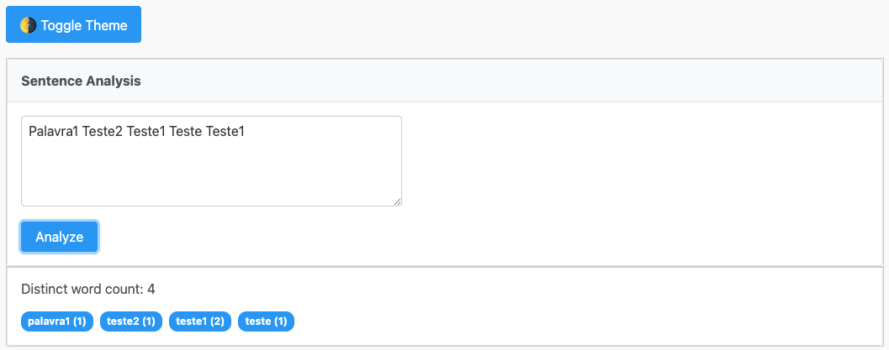
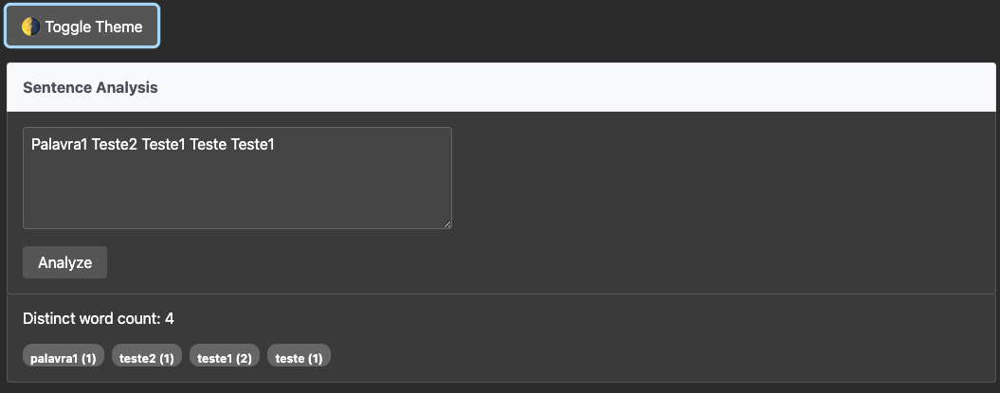

# 📝 JSF Sentence Analyzer

A simple web application built with Java EE (JSF + CDI) and PrimeFaces that allows users to input a sentence and get an analysis of:
- The number of **distinct words**
- The **frequency of each word**

It includes a modern UI with theme toggling (light/dark), runs synchronously, and is compatible with WildFly 10.

---

## 📸 Preview

<p align="center">
  
</p>

<p align="center">
  
</p>

---

## 🚀 Features

- ✅ Sentence input via PrimeFaces `<p:inputTextarea>`
- ✅ Live frequency display with `<p:chip>` for each word
- ✅ Toggleable light/dark theme
- ✅ Input validation and user-friendly feedback
- ✅ Clean and responsive UI
- ✅ Word parsing with regex cleanup
- ✅ Written in Java 8 and compatible with WildFly 10
- ✅ Includes unit tests with JUnit 5

---

## 🛠️ Tech Stack

| Layer         | Tech                           |
|---------------|--------------------------------|
| Frontend      | JSF 2.x, PrimeFaces, XHTML, CSS |
| Backend       | Java 8, CDI (`@Named`, `@Inject`) |
| Build Tool    | Maven                          |
| Server        | WildFly 10                     |
| Test Framework| JUnit 5                        |

---

## 🧪 Running Locally (WildFly 10)

### Prerequisites

- Java 8
- Maven
- WildFly 10+

### Build & Deploy

```bash
# Clone the project
git clone https://github.com/your-user/jsf-analyzer.git
cd jsf-analyzer

# Package the application
mvn clean package

# Deploy to WildFly (copy WAR)
cp target/jsfanalyzer.war $WILDFLY_HOME/standalone/deployments/


# 📝 JSF Sentence Analyzer

A simple web application built with Java EE (JSF + CDI) and PrimeFaces that allows users to input a sentence and get an analysis of:
- The number of **distinct words**
- The **frequency of each word**

It includes a modern UI with theme toggling (light/dark), runs synchronously, and is compatible with WildFly 10.

---

## 📸 Preview

<p align="center">
  
</p>

<p align="center">
  
</p>

---

## 🚀 Features

- ✅ Sentence input via PrimeFaces `<p:inputTextarea>`
- ✅ Live frequency display with `<p:badge>`
- ✅ Toggleable light/dark theme
- ✅ Input validation and user-friendly feedback
- ✅ Clean and responsive UI
- ✅ Word parsing with regex cleanup
- ✅ Written in Java 8 and compatible with WildFly 10
- ✅ Includes unit tests with JUnit 5

---

## 🛠️ Tech Stack

| Layer         | Tech                           |
|---------------|--------------------------------|
| Frontend      | JSF 2.x, PrimeFaces, XHTML, CSS |
| Backend       | Java 8, CDI (`@Named`, `@Inject`) |
| Build Tool    | Maven                          |
| Server        | WildFly 10                     |
| Test Framework| JUnit 5                        |

---

## 🧾 Project Structure

src/
├── main/
│   ├── java/br/com/prover/jsfanalyzer/
│   │   ├── bean/AnalyzerBean.java
│   │   ├── model/AnalyzerResult.java
│   │   └── service/AnalyzerService.java
│   └── webapp/
│       ├── css/
│       │   ├── light.css
│       │   └── dark.css
│       ├── index.xhtml
│       └── WEB-INF/
│           ├── web.xml
│           ├── faces-config.xml
│           └── beans.xml
└── test/
└── java/br/com/prover/jsfanalyzer/service/
└── AnalyzerServiceTest.java

---

## 🧪 Running Locally (WildFly 10)

### Prerequisites
- Java 8
- Maven
- WildFly 10+

### Build & Deploy

```bash
# Clone the project
git clone https://github.com/your-user/jsf-analyzer.git
cd jsf-analyzer

# Package the application
mvn clean package

# Deploy to WildFly (copy WAR)
cp target/jsfanalyzer.war $WILDFLY_HOME/standalone/deployments/

Then visit: http://localhost:8080/jsfanalyzer


✅ Running Tests

mvn test

The test suite validates the text analysis logic, including edge cases.

📋 Example Input

“Testing testing the sentence analyzer”

Output
	•	Distinct word count: 4
	•	Frequencies:
	•	testing (2)
	•	the (1)
	•	sentence (1)
	•	analyzer (1)

⸻

🧠 Future Improvements (Optional)
	•	🌐 i18n with resource bundles
	•	💬 Real-time validation with p:ajax
	•	📈 Add charting (word cloud or bar chart)

⸻

📄 License

MIT — feel free to fork, reuse and build on it.

⸻

👨‍💻 Author

Gabriel Mendes
📧 [gabrielmendes17@gmail.com]
🔗 linkedin.com/in/gabrielmendes17
